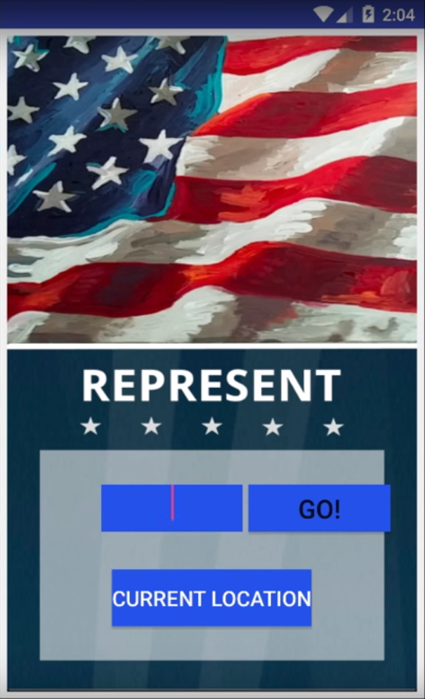

# PROG 02: Represent!

This Represent is a mobile ineraction wear application whose main objective is to provides information on congressional representatives based on a current location or a ZIP code that is provided.  

## Authors

Casey Nguyen ([caseynguyen@berkeley.edu](mailto:your_email@berkeley.edu))

## Demo Video

See [Proj02B] (https://www.youtube.com/watch?v=O_MjgUsoNCQ&feature=youtu.be)

## Screenshots

## Acknowledgments

* Hat tip to anyone who's code was used CS160 staff for sample code and elimiz from stackoverflow
* Any other support
