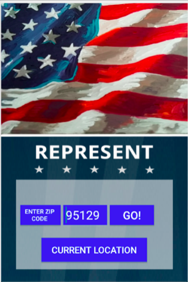
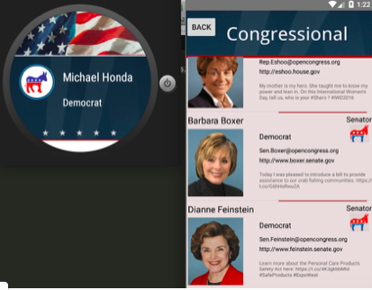
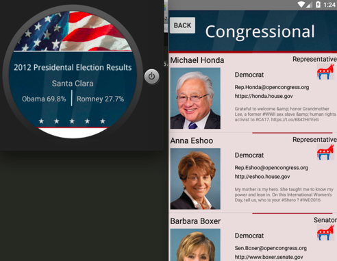

# PROG 02: Represent!

This Represent is a mobile interaction wear application whose main objective is to provide information on congressional representatives based on the user’s current location or a ZIP code that is provided. If the current location is selected, then a screen will display exactly three congressional representative, two senators and one house of representative, in the current area. If a Zip Code is provided, then the application will display basic information about two senators and at least one house of representative. There may be more representatives because they are by district and Zip codes are not district aligned. Once the basic information from either the Zip code or current location about the congressional members are loaded, the watch application simultaneously load information about these congressional members to display. The watch feature can also display the last presidential election result for the same county as the house of representative. From the phone, a more detail information can be displayed by simply tapping on that member after seeing their basic information.

## Authors

Casey Nguyen ([caseynguyen@berkeley.edu](mailto:your_email@berkeley.edu))

## Demo Video

See [Proj02C] (https://www.youtube.com/watch?v=-bUBlHuyowM)

## Screenshots

## Acknowledgments

* Hat tip to anyone who's code was used CS160 staff for sample code and elimiz from stackoverflow
* Any other support
